```mermaid
graph TD
    ROOT["ACCESSLIST"] --> AI
    AI --> AI_JAILBREAK["ai_jailbreak"]
    AI --> simulation["simulation"]
    AI_JAILBREAK --> AI_CHATGPT["chatgpt"]
    AI_JAILBREAK --> AI_DEEPSEEK["DeepSeek"]

    ROOT --> BUGBOUNTY["bugbounty"]
    BUGBOUNTY --> BB_AUTO["Automation Process Using CSV"]
    BUGBOUNTY --> BB_IDOR["IDOR"]
    BUGBOUNTY --> BB_IOS["ios"]
    BB_IOS --> BB_IOS_BT["bluetooth"]
    BUGBOUNTY --> BB_POC["POC"]

    ROOT --> COMBOS["Combos"]
    ROOT --> DEFAULT["default"]
    DEFAULT --> DEFAULT_LOGIN["login"]

    ROOT --> DORKS["dorks"]
    ROOT --> FLAW["Flaw"]
    FLAW --> FLAW_UNION["UnionPay android security payment vulnerabilities"]
    FLAW --> FLAW_WIN["Windows"]

    ROOT --> FORENSIC["forensic"]
    FORENSIC --> FORENSIC_IMG["image"]

    ROOT --> FUZZING["Fuzzing"]
    ROOT --> PASSWORDS["Passwords"]

    ROOT --> SHELLS["Shells"]
    SHELLS --> SHELLS_LINUX["Linux"]
    SHELLS_LINUX --> SHELLS_LINUX_CVE["CVE_2025_22035"]
    SHELLS --> SHELLS_MAC["Macos"]
    SHELLS --> SHELLS_WIN["Windows"]

    ROOT --> STEG["steganography"]
    ROOT --> UNAUTH["Unauthorized"]

    ROOT --> VULNS["Vulnerabilities"]
    VULNS --> VULNS_CVE1["CVE_2024_7414_video"]
    VULNS --> VULNS_CVE2["CVE_2025_0411_7_zip"]
    VULNS --> VULNS_CVE3["CVE_2025_22035"]
    VULNS --> VULNS_MAG["Magneto"]
    VULNS --> VULNS_WP["Wordpress"]

    ROOT --> WORDLISTS["wordlists_tb"]
    WORDLISTS --> WORDLISTS_WEB["forweb"]
```

## 1 Repo For Everything !!!
## Access list is a collection of multiple types of lists used during pentesting, collected in one place, created by [Undercode](https://undercode.help)
[](https://undercode.help/community)

## This list include a collections of Tools, Combos, wordlists shells, exploits and Vulnerabilities and may more…

- - -

### Install

**As Zip**
```
wget -c https://github.com/undercodeutilities/Accesslist/archive/main.zip -O Accesslist.zip \
  && unzip Access.zip \
  && rm -f Access.zip
```


**Git**
```
git clone https://github.com/undercodeutilities/Accesslist.git
```

- - -

### Licensing

This project is licensed under the [MIT license](LICENSE).


- - -

<p align="center">
  <a href="https://github.com/undercodeutilities?tab=followers">
    
  </a>
  <a href="http://twitter.com/undercodeupdate">
    
  </a>
  <a href="https://www.youtube.com/undercode?sub_confirmation=1">
    
  </a>
</p>



- - -

### Donations

If you find this project useful, consider [buying me a coffee](https://buymeacoffee.com/undercode) to show your support and help us share more valuable content. ☕💖

[](https://buymeacoffee.com/undercode)

- - -

## Join Us

Join Our Cyber Groups:

[](https://undercode.help/whatsapp)
[](https://t.me/undercodeCommunity)

- - -

### Videos

[AI Prompt - Permanent](https://youtube.com/shorts/wVxWqGRVHAg?feature=share)

- - -

## More

[Official Website](https://Undercode.help)

[CVE Updates & Database ](https://dailycve.com)

[Cyber & Tech News](https://UndercodeNews.com)

[Hackers Monitor & Tutorials](https://UndercodeTesting.com)
