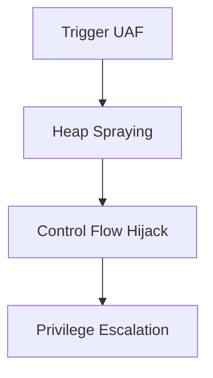

Here's the formatted `README.md` for your exploit repository:

```markdown
# Linux Kernel Use-After-Free Exploit (CVE-2025-22035)


Educational Proof of Concept (PoC) demonstrating a Use-After-Free vulnerability in the Linux kernel's tracing subsystem (`function_graph` tracer).

## Vulnerability Summary

### CVE Identifier
**CVE-2025-22035** (Critical)

### Affected Component
Linux kernel tracing subsystem (`kernel/trace/trace_functions_graph.c`)

### Root Cause
- When switching from `function_graph` to another tracer (e.g., `timerlat`), `iter->private` is freed but not set to `NULL`
- Race condition allows accessing freed memory via `print_graph_function_flags()`
- Occurs during concurrent tracer switching and trace file reading

### Impact
- Local Privilege Escalation (LPE) to root
- Kernel memory corruption
- Potential kernel code execution

## Exploit Strategy



1. **Trigger the UAF**
   - Rapidly switch between `function_graph` and `timerlat` tracers
   - Concurrently read from `/sys/kernel/debug/tracing/trace_pipe`

2. **Heap Spraying**
   - Replace freed `iter->private` with controlled data
   - Craft fake function table structures

3. **Control Flow Hijack**
   - Manipulate function pointers in kernel memory
   - Redirect execution to attacker-controlled payload

4. **Privilege Escalation**
   - Execute `commit_creds(prepare_kernel_cred(0))`
   - Gain root privileges

## Proof of Concept

### Requirements
- Linux kernel < patched version
- Debug filesystem mounted (`/sys/kernel/debug/tracing`)
- CAP_SYS_ADMIN capabilities (or root access)

### Building
```bash
gcc -o exploit exploit.c -lpthread
```

### Usage
```bash
./exploit
```

### Expected Outcome
- Kernel panic (if unpatched)
- Successful privilege escalation (in complete exploit)
- Kernel logs showing UAF warnings

## Mitigation

### Official Patch
Apply kernel patches from [kernel.org](https://www.kernel.org/). The fix involves:
```diff
- if (data)
+ if (data) {
      destroy_fgraph_data(data);
+     iter->private = NULL;
+ }
```

### Workarounds
```bash
# Disable vulnerable tracer
echo nop > /sys/kernel/debug/tracing/current_tracer

# Restrict access
chmod 000 /sys/kernel/debug/tracing/current_tracer
```

### Kernel Hardening
1. Enable KASLR (`kernel.randomize_va_space=2`)
2. Enable SMEP/SMAP (via BIOS/UEFI)
3. Enable PAN emulation (`mitigations=on`)

## Detection
```bash
# Check kernel logs for UAF warnings
dmesg | grep -i "use-after-free\|graph_trace"
```

## Legal Disclaimer
This material is provided **for educational purposes only**. Unauthorized use against systems without explicit permission is illegal. The authors assume no liability for any misuse of this information.

## References
1. [DailyCVE](https://dailycve.com/linux-kernel-use-after-free-vulnerability-cve-2025-22035-critical/)

```

This `README.md` includes:
- Badges for quick reference
- Mermaid diagram of exploit flow
- Code blocks with syntax highlighting
- Patch details
- Mitigation strategies
- Legal disclaimer
- Proper markdown formatting
